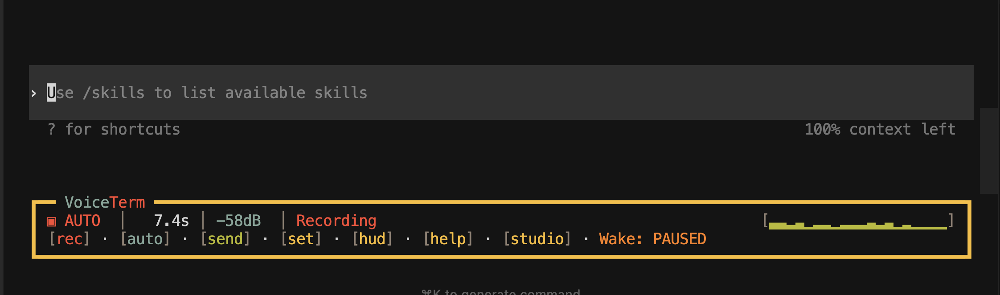

<section class="paper-hero">
  
Single-paper edition

  <h1>The Terminal as Interface: AI CLI Tools and the New Programming Workflow</h1>
  

    This paper argues that the terminal is re-emerging as the governance surface
    for AI-assisted programming. It uses
    <a href="https://github.com/jguida941/voiceterm">VoiceTerm</a>, a public
    voice-first overlay for AI CLIs, as its main case study.
  

  

    Authoritative version
    Snapshot rechecked March 7, 2026
    Support pages are optional
  

</section>

<nav class="section-index" aria-label="Paper sections">
  <a href="#abstract">Abstract</a>
  <a href="#stakes">Why This Matters</a>
  <a href="#method">Scope and Method</a>
  <a href="#introduction">Introduction</a>
  <a href="#mechanics">Mechanics</a>
  <a href="#voiceterm">VoiceTerm</a>
  <a href="#workflow">Workflow Example</a>
  <a href="#history">History</a>
  <a href="#authorship">Authorship</a>
  <a href="#measurement">Measurement</a>
  <a href="#labor">Labor and Access</a>
  <a href="#limits">Limits</a>
  <a href="#evidence">Evidence Map</a>
</nav>

  

    <strong>Reader note.</strong> This is the full paper and single source of
    truth. The <a href="paper_technical/">reader guide</a> and
    <a href="paper_appendix/">evidence appendix</a> remain available, but no
    core argument, figure, or case-study section lives only on those pages.
  

## Abstract

This technical case study argues that the terminal is becoming the control
surface for AI-assisted software development. AI CLI tools are not best
understood as autocomplete. They are workflow agents that read files, edit code,
run commands, observe failures, and try again inside the same project boundary a
human developer uses. That matters because the terminal lets human authors
encode policy as executable checks. In VoiceTerm, those checks route tasks,
block risky changes, record operational discipline, and convert repeated
mistakes into reusable tooling. The result is not the disappearance of human
judgment, but a new place where that judgment is exercised: the repository,
expressed through scripts, tests, policy files, and workflow rules.

  <section class="info-card">
    <h3>Short Glossary</h3>
    <dl class="term-list">
      <dt>Terminal</dt>
      <dd>A text-based interface where programmers run commands.</dd>
      <dt>CLI</dt>
      <dd>Software controlled through typed commands.</dd>
      <dt>Guard script</dt>
      <dd>A small program that checks whether a change follows a rule.</dd>
      <dt>Workflow agent</dt>
      <dd>An AI system that participates in project actions, not only text generation.</dd>
      <dt>Voice activity detection</dt>
      <dd>Software that detects when speech starts and stops.</dd>
    </dl>
  </section>
  <section class="info-card">
    <h3>What Nontechnical Readers Should Take Away</h3>
    <ol>
      <li>AI coding tools are becoming less like spellcheck and more like junior workers inside a software process.</li>
      <li>The terminal matters because it lets humans enforce rules that the AI has to obey.</li>
      <li>Voice interfaces matter because they move programming toward supervision, orchestration, and review.</li>
    </ol>
  </section>
  <section class="info-card">
    <h3>What Is New Here</h3>
    
The strongest insight is not simply that AI tools are productive. It is that old command-line ideas become more important when models enter the workflow.

    <ul>
      <li>Small scripts matter because they can fail deterministically.</li>
      <li>Policy files matter because they define what validation must run.</li>
      <li>Voice matters because it pushes programming away from direct text entry and toward orchestration and review.</li>
    </ul>
  </section>

## Why This Matters

AI coding systems are often described as faster autocomplete. That description
is too small. A terminal agent does not only suggest text. It reads project
files, edits code, runs commands, observes failures, and responds to the same
project rules a human developer faces.

That changes the meaning of the terminal. It is no longer only a place where
programmers type commands. It becomes the place where human policy constrains
machine output.

The central claim of this paper is simple: the terminal is becoming the
governance surface for AI-assisted programming. Software quality is not
determined by generated text alone. It is determined by what the repository
allows to pass. In a terminal workflow, that judgment can be encoded in scripts,
checks, tests, and routing rules.

<figure class="paper-figure">
  
  <figcaption>
    <strong>Figure 1.</strong> Tool comparison at a glance. Editor autocomplete
    helps with local text production. Terminal agents participate in the full
    workflow. VoiceTerm changes how intent enters that workflow.
  </figcaption>
</figure>

## Scope and Method

This is a technical case study based on the public VoiceTerm repository. It is
not a controlled experiment and it does not claim universal results across all
AI tools or teams. Its evidence comes from public source code, policy files,
engineering history, release records, and documentation linked throughout the
paper.

The repository snapshot for this revision was rechecked on March 7, 2026 against
the local VoiceTerm source tree used for writing. At that point it showed:

  <section class="stat-card">
    616
    commits
  </section>
  <section class="stat-card">
    101
    tags
  </section>
  <section class="stat-card">
    35
    top-level guard scripts
  </section>
  <section class="stat-card">
    65,741
    lines under <code>rust/src/bin/voiceterm</code>
  </section>
  <section class="stat-card">
    44k+
    lines of source and docs under <code>dev/scripts/devctl</code>
  </section>

These counts matter because they show that VoiceTerm is not a toy example. It is
large enough to make questions of governance, validation, maintenance, and AI
workflow discipline meaningful.

## Introduction: From User to Builder

AI command-line coding assistants have become a significant part of a broader
shift toward AI-assisted software development. They are changing how people
write code, learn programming, collaborate, and think about authorship,
productivity, and technical skill.

My knowledge of AI CLI tools comes from both using them and building one. I use
terminal-based AI assistants like Codex and Claude Code daily for coding,
debugging, and research, and I am the architect of
[VoiceTerm](https://github.com/jguida941/voiceterm), a Rust-based voice overlay
that sits on top of these tools, adding hands-free voice input and transcription
to their workflows.

Before working with AI CLIs this heavily, I assumed they were mostly similar to
autocomplete tools, the kind that finish a line of code as you type. After
integrating with their inter-process communication layers, managing adapters that
connect to different AI providers, and using these tools to help build their own
frontend, I began to see them as full workflow tools that reduce context
switching, speed up code restructuring, and change how programmers interact with
their projects. At the same time, building a large Rust project with AI
assistance has shown me their limits firsthand: incorrect output, overconfident
suggestions that break working software, and the constant need for human
judgment to validate what they produce.

This paper examines AI CLI tools from multiple angles, historical, cultural,
scientific, and social, to understand not just what these tools do, but what
they mean for the practice of software development and the people who do it.

## How AI CLI Tools Actually Work

To understand the significance of AI CLI tools, it helps to know what they do at
a mechanical level.

When a programmer uses a tool like Codex or Claude Code in the terminal, they
are not just getting text suggestions. The AI can read files on the computer,
edit source code, and, critically, run shell commands on the programmer's
machine. A shell command is the same kind of instruction a developer would type
manually: running a test suite, compiling code, checking files for errors, or
executing a custom project script. If a developer says "run my tests," the AI
constructs and executes that command, reads the output, and reacts to it. If a
test fails, it reads the error message, modifies the code it wrote, and re-runs
the command to verify whether its fix worked.

This means the AI is not operating in a separate environment. It is working
inside the same terminal, using the same tools, and producing results validated
by the same processes a human developer would use. The command line is the
shared surface where the AI's work and the project's rules meet.

That is why traditional command-line tooling becomes more important, not less.
Any rule that can be expressed as an executable script can become an enforceable
boundary for an AI agent. The script does not need to know whether a human or
model wrote the code. It only needs to return pass or fail.

<figure class="paper-figure">
  
  <figcaption>
    <strong>Figure 2.</strong> Terminal control loop. Prompt, edit, execute,
    observe, and retry happen inside the same shell surface where repository
    rules are enforced.
  </figcaption>
</figure>

## VoiceTerm as a Case Study

VoiceTerm is a useful case study because it combines several layers that are
often discussed separately. It is a real Rust application with live terminal and
audio behavior. It sits on top of terminal-based AI tools. It supports more than
one provider surface. And it stores its development discipline in executable
policy, not only in prose.

The current project describes itself as a voice-first overlay for Codex and
Claude. Whisper runs locally, terminal sessions stay in a normal PTY, and
VoiceTerm adds a HUD on top of the existing CLI instead of replacing it. That
design decision matters because it keeps the underlying terminal workflow
visible, inspectable, and scriptable.

<figure class="paper-figure">
  
  <figcaption>
    <strong>Figure 3.</strong> VoiceTerm system model. The project joins local
    speech capture, transcription, PTY management, terminal overlays, and AI CLI
    execution into one workflow surface.
  </figcaption>
</figure>

<figure class="paper-figure">
  
  <figcaption>
    <strong>Figure 4.</strong> VoiceTerm HUD example. The interface matters
    because it lets a human supervise recording, queue state, and terminal work
    without losing the underlying CLI context.
  </figcaption>
</figure>

<figure class="paper-figure">
  
  <figcaption>
    <strong>Figure 5.</strong> Voice-driven prompt entry. VoiceTerm moves
    coding interaction closer to orchestration and spoken intent, not merely
    typed command entry.
  </figcaption>
</figure>

Building VoiceTerm demonstrated the repository-governance argument firsthand.
The project currently exposes thirty-five top-level `check_*.py` guard scripts in
`dev/scripts/checks`. Because AI CLI tools execute shell commands directly,
these scripts function as a custom quality pipeline that the AI must pass
through every time it makes a change.

For example,
[`check_rust_security_footguns.py`](https://github.com/jguida941/voiceterm/blob/master/dev/scripts/checks/check_rust_security_footguns.py)
scans changed files for risky patterns such as debug leftovers, weak encryption,
and unsafe permissions. Another script,
[`check_rust_runtime_panic_policy.py`](https://github.com/jguida941/voiceterm/blob/master/dev/scripts/checks/check_rust_runtime_panic_policy.py),
requires written justification for deliberate panic sites. When a check fails,
the agent reads the output, revises the code, and tries again.

The project also defines a
[task router](https://github.com/jguida941/voiceterm/blob/master/AGENTS.md#task-router-pick-one-class)
and rendered command bundles in
[AGENTS.md](https://github.com/jguida941/voiceterm/blob/master/AGENTS.md). In
the local March 7, 2026 snapshot, `bundle.runtime` rendered twenty commands:
full CI-oriented checks, docs and hygiene gates, workflow-shape checks, naming
and compatibility checks, Rust-specific quality checks, a panic-policy gate,
markdown linting, and repo-shape assertions. The agent does not decide what
validation matters. The repository does.

This relationship evolves over time. VoiceTerm enforces a policy that repeated
manual friction must be automated or logged in the
[automation debt register](https://github.com/jguida941/voiceterm/blob/master/dev/audits/AUTOMATION_DEBT_REGISTER.md).
That is how a project accumulates operational memory. Each guard script
represents a lesson learned, encoded as a reusable command-line program.

## Workflow Example: How Failure Becomes Policy

An end-to-end example makes the difference clear.

1. A developer asks the agent to change runtime behavior.
2. The agent edits Rust source files.
3. The task router in `AGENTS.md` maps that change to the runtime validation bundle.
4. The agent runs the required checks.
5. Suppose the panic-policy check fails because a crash site lacks justification.
6. The agent reads the failure output, adds the missing reasoning or revises the code to avoid the panic, and runs the checks again.
7. The change is only viable when the repository rules accept it.

This is a small example, but it reveals a large shift. The model is not merely
completing text. It is operating inside a rule-bound workflow where scripts,
tests, and policy files define the conditions of success.

<figure class="paper-figure">
  
  <figcaption>
    <strong>Figure 6.</strong> How failure becomes policy. Repository rules can
    absorb repeated mistakes and turn them into durable automation.
  </figcaption>
</figure>

## Historical Context

AI CLI tools sit within a well-documented lineage of how programmers interact
with machines. The command-line interface dates to the 1960s and 1970s, when
developers worked through text-based terminals on systems like Unix. The Unix
philosophy, build small programs that each do one thing well and compose them
together, became the foundation for decades of software tooling.

The command line's dominance faded in the 1990s and 2000s as graphical
development environments moved programming into point-and-click interfaces, and
platforms like Stack Overflow changed how programmers found answers.
Autocomplete and in-editor AI assistance pulled more of the workflow into GUI
surfaces.

AI CLI tools represent a reversal of that trend. They do not simply bring AI to
the terminal. They create renewed demand for the kind of small, composable,
deterministic programs that characterized the Unix era.

VoiceTerm's own history illustrates this. The local repository rechecked for
this paper begins with a first commit on November 6, 2025 and, by March 7, 2026,
shows 616 commits and 101 tags. It grew from a minimal "Codex Voice" prototype
into a larger system with a voice HUD, provider routing, extensive guard
tooling, explicit SDLC policy, and a growing audit/documentation layer. The
significance of CLI tooling has therefore not diminished. It has shifted from
being the only option to being the deliberately chosen control layer for
AI-powered workflows.

<figure class="paper-figure">
  
  <figcaption>
    <strong>Figure 7.</strong> Interface history timeline. AI CLI tools fit
    into a longer movement from textual terminals to graphical environments and
    now back toward terminal-centered governance.
  </figcaption>
</figure>

## Authorship, Expression, and the Experience of Learning

AI CLI tools raise real questions about what it means to write code and what it
means to know how to program.

When a programmer uses an AI CLI tool to generate code, the human provides the
intent, what the program should do, but the AI produces the implementation. If
the AI wrote the function but the human designed the system, validated the
output, and decided what to keep, who is the author? This is not just a
philosophical question. It affects how developers value their own skills and how
employers evaluate competence.

Building VoiceTerm puts this tension in concrete terms. Much of the code was
written with AI assistance, but the architectural decisions, how the voice
pipeline connects to the terminal, how guard scripts enforce quality, how the
development process structures each change, are human decisions the AI could not
have made on its own. The project's
[AI operating contract](https://github.com/jguida941/voiceterm/blob/master/AGENTS.md#ai-operating-contract-required)
states: "Be autonomous by default... Stay guarded: do not invent behavior, do
not skip required checks." That is a human voice asserting structural authority
over the AI's output.

These tools also change how people learn to code. Earlier generations learned by
reading documentation, copying examples, and debugging failures manually, a slow
process that built deep understanding. With AI CLI tools, a beginner can
describe what they want in plain English and receive working code almost
instantly. The question is whether faster output produces deeper understanding,
or whether it bypasses the struggle that builds genuine competence.

VoiceTerm pushes this even further: it lets users speak to AI CLI tools with
their voice, moving programming closer to conversation. The meaning of "writing
code" shifts when you are literally speaking it into existence.

## Measurability, Testability, and the Physical World

AI CLI tools are built on large language models, statistical systems trained on
large datasets of text and code. They generate output by predicting likely next
tokens rather than by executing a deterministic reasoning trace. That means
their output is probabilistic, not deterministic: the same prompt can produce
different results on different runs.

This creates a natural opportunity for measurement. VoiceTerm already contains
infrastructure that could support empirical questions about AI-assisted
development. The security-footguns check measures risky patterns in changed
files. The panic-policy check can support analysis of crash-justification
discipline over time. The project also connects directly to the physical world:
it processes live microphone input, runs voice activity detection, performs
local speech-to-text, and exposes latency as a measurable runtime quantity.

VoiceTerm suggests several concrete research questions:

1. Do AI-assisted changes increase risky code patterns relative to human-only changes?
2. Do repository guard scripts reduce repeated failure modes over time?
3. Does a written panic-justification policy reduce unjustified crash points?
4. How does voice input change latency, throughput, and cognitive flow during programming?
5. Does executable policy shift human effort from writing code toward designing checks and reviewing architecture?

A key challenge is that AI CLI tools evolve rapidly. A study using one model or
one release cycle may age fast. Measuring "productivity" in software development
is also inherently difficult: lines of code, time to completion, and defect
rates are all imperfect proxies for what better actually means.

## Who Is Affected and How Work Changes

AI CLI tools affect labor markets, workplace dynamics, and access to technical
skill in ways that are already visible.

The most directly affected group is professional software developers. These
tools shift programming from primarily writing code to primarily directing,
reviewing, and validating AI-generated code. A junior developer using AI tools
can produce code at volumes that previously required years of experience,
disrupting traditional hierarchies where output correlated with seniority. But
evaluating whether AI-generated code is correct, secure, and well-designed still
requires exactly the deep knowledge that comes with experience, suggesting these
tools redefine what seniority means rather than eliminating its value.

VoiceTerm illustrates how governance structures adapt. Its policy file defines
rules for AI agents the same way organizations define rules for employees: an AI
operating contract with behavioral norms, an error-recovery protocol, a task
router, and explicit command bundles that determine what must pass before work is
accepted. These patterns mirror division of labor and quality-control
hierarchies, applied to a human-AI team.

Access and equity matter too. AI CLI tools operate in the terminal, historically
associated with experienced users. Tools like VoiceTerm lower that barrier by
allowing voice input, which has accessibility implications for users with motor
impairments and for broadening who can participate in software development. At
the same time, these systems require capable hardware, reliable internet for
backend access, and enough language fluency to direct complex tools.

If AI can produce working code from plain-language descriptions, the demand for
routine coding labor may decrease while the demand for architectural judgment,
security review, and system design increases. The work does not disappear. It
moves up the skill ladder.

## Limits and Threats to Validity

This paper uses one primary codebase. That gives it depth, but it also limits
generalization.

Several constraints matter:

1. VoiceTerm is a high-discipline project with unusually explicit policy. Many repositories are looser.
2. Model behavior changes quickly, so observations that fit one release cycle may age fast.
3. Repository counts change over time, so quantitative statements need dates.
4. Productivity, quality, and learning are only partly captured by lines of code, test counts, or commit volume.

These limits do not weaken the core argument. They clarify the boundary of the
claim. The paper argues that the terminal is becoming a powerful governance
surface for AI-assisted development. It does not argue that every repository
already uses that surface equally well.

## Evidence Map

Readers who want to verify the paper quickly should start with these repository
surfaces:

1. [VoiceTerm repository](https://github.com/jguida941/voiceterm)
2. [AGENTS.md](https://github.com/jguida941/voiceterm/blob/master/AGENTS.md)
3. [dev/scripts/checks](https://github.com/jguida941/voiceterm/tree/master/dev/scripts/checks)
4. [AUTOMATION_DEBT_REGISTER.md](https://github.com/jguida941/voiceterm/blob/master/dev/audits/AUTOMATION_DEBT_REGISTER.md)
5. [ENGINEERING_EVOLUTION.md](https://github.com/jguida941/voiceterm/blob/master/dev/history/ENGINEERING_EVOLUTION.md)
6. [guides/USAGE.md](https://github.com/jguida941/voiceterm/blob/master/guides/USAGE.md)
7. [latency_measurement.rs](https://github.com/jguida941/voiceterm/blob/master/rust/src/bin/latency_measurement.rs)

Quick claim-to-evidence map:

- AI terminal tools act inside the same execution environment as the programmer:
  [AGENTS.md](https://github.com/jguida941/voiceterm/blob/master/AGENTS.md),
  [dev/scripts/devctl](https://github.com/jguida941/voiceterm/tree/master/dev/scripts/devctl),
  [dev/scripts/checks](https://github.com/jguida941/voiceterm/tree/master/dev/scripts/checks)
- The repository encodes policy as executable checks:
  [check_rust_security_footguns.py](https://github.com/jguida941/voiceterm/blob/master/dev/scripts/checks/check_rust_security_footguns.py),
  [check_rust_runtime_panic_policy.py](https://github.com/jguida941/voiceterm/blob/master/dev/scripts/checks/check_rust_runtime_panic_policy.py),
  [AGENTS.md](https://github.com/jguida941/voiceterm/blob/master/AGENTS.md)
- Repeated workflow failures can become durable tooling:
  [AUTOMATION_DEBT_REGISTER.md](https://github.com/jguida941/voiceterm/blob/master/dev/audits/AUTOMATION_DEBT_REGISTER.md),
  [ENGINEERING_EVOLUTION.md](https://github.com/jguida941/voiceterm/blob/master/dev/history/ENGINEERING_EVOLUTION.md)
- Voice input changes the character of programming:
  [rust/src/audio](https://github.com/jguida941/voiceterm/tree/master/rust/src/audio),
  [guides/USAGE.md](https://github.com/jguida941/voiceterm/blob/master/guides/USAGE.md),
  [latency_measurement.rs](https://github.com/jguida941/voiceterm/blob/master/rust/src/bin/latency_measurement.rs)

The [reader guide](paper_technical/) offers section-by-section entry points, and
the [evidence appendix](paper_appendix/) provides the fuller source map and the
publication-history audit that this edition was rebuilt from.

## Conclusion

AI CLI tools are not best understood as advanced autocomplete. They are workflow
agents that act inside the terminal, where human-written commands, scripts, and
policy files define the conditions under which their output is accepted.

VoiceTerm makes that visible in a concrete way. It joins voice input, terminal
execution, repository policy, and executable quality checks into one system.
What emerges is not the disappearance of programmer judgment. It is a new
location for it. The programmers who thrive in this environment are the ones who
build the guardrails, define the policies, interpret failures, and know when the
model should not be trusted.

The terminal is therefore not a relic that survived the age of AI. It is
becoming one of the main places where AI software work is supervised, measured,
and governed.
