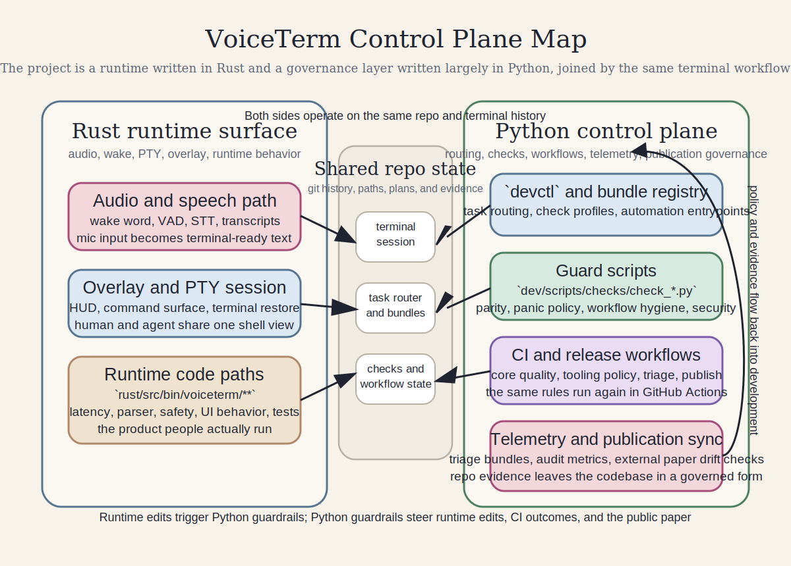
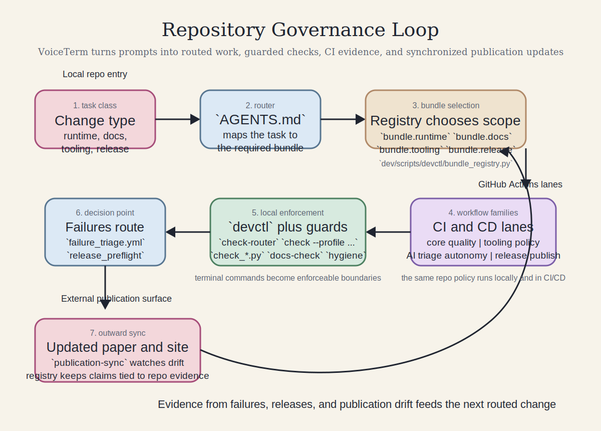



<section class="paper-hero">
  
Single-paper edition

  <h1>The Terminal as Interface: AI CLI Tools and the New Programming Workflow</h1>
  

    This paper argues that AI-assisted programming is moving into a governed
    terminal workflow. It uses
    <a href="https://github.com/jguida941/voiceterm">VoiceTerm</a>, a public
    repository that combines a Rust runtime, a Python control plane, routed
    command bundles, GitHub Actions lanes, audit telemetry, and publication
    sync, as its main case study.
  

  

    Single source of truth
    Live repo snapshot {{ vt.snapshot_label }}
    {{ vt.stats.guard_scripts.display }} guard scripts and {{ vt.stats.workflows.display }} GitHub Actions workflows
    Site deploy refreshes the snapshot before publish
  

</section>

<nav class="section-index" aria-label="Paper sections">
  <a href="#abstract">Abstract</a>
  <a href="#stakes">Why This Matters</a>
  <a href="#method">Scope and Method</a>
  <a href="#control-system">Control System</a>
  <a href="#voiceterm">VoiceTerm</a>
  <a href="#cicd">CI/CD</a>
  <a href="#workflow">Workflow Example</a>
  <a href="#history">History</a>
  <a href="#authorship">Authorship</a>
  <a href="#measurement">Measurement</a>
  <a href="#labor">Labor and Access</a>
  <a href="#limits">Limits</a>
  <a href="#evidence">Evidence Map</a>
</nav>

  

    <strong>Reader note.</strong> This is the full paper and single source of
    truth. The <a href="paper_technical/">reader guide</a> and
    <a href="paper_appendix/">evidence appendix</a> remain available, but no
    core argument or primary figure lives only on those pages. The repository
    counts on this page are generated during site deploy from the public
    VoiceTerm repository instead of being maintained by hand.
  

## Abstract

This technical case study argues that the terminal is becoming the governance
surface for AI-assisted software development. AI CLI tools are not best
understood as autocomplete. They are workflow agents that read files, edit
code, run commands, observe failures, and try again inside the same project
boundary a human developer uses. What matters is not only the model or the
overlay. What matters is the control system around them: task routing in
`AGENTS.md`, command bundles rendered from a registry, local `devctl` commands,
top-level `check_*.py` guard scripts, GitHub Actions workflow families,
release-gate automation, audit telemetry, and publication-sync checks. In
VoiceTerm, those surfaces decide what work can pass, what failures must be
explained, and what public claims stay tied to repository evidence.

  <section class="info-card">
    <h3>Short Glossary</h3>
    <dl class="term-list">
      <dt>Bundle</dt>
      <dd>A named command set the repository requires for one class of work.</dd>
      <dt>Guard script</dt>
      <dd>A small program that can fail a change when a project rule is violated.</dd>
      <dt>Control plane</dt>
      <dd>The routing, validation, and automation layer that governs the runtime.</dd>
      <dt>CI/CD lane</dt>
      <dd>A GitHub Actions workflow that reruns policy after local changes are pushed.</dd>
      <dt>Publication sync</dt>
      <dd>A check that outward-facing docs stay aligned with the repository source of truth.</dd>
    </dl>
  </section>
  <section class="info-card">
    <h3>What Nontechnical Readers Should Take Away</h3>
    <ol>
      <li>AI coding tools are becoming bounded workers that read files, run commands, and revise their own work.</li>
      <li>The important interface is not only a chat box or a microphone. It is the terminal plus repository policy, where scripts, tests, and workflows decide what survives.</li>
      <li>VoiceTerm is a strong case study because the public repo exposes the whole supervision stack, not just the visible app.</li>
    </ol>
  </section>
  <section class="info-card">
    <h3>What Is New Here</h3>
    <ul>
      <li><code>AGENTS.md</code> classifies work into routed bundles instead of leaving validation to ad hoc judgment.</li>
      <li><code>devctl</code> and <code>check_*.py</code> turn policy into executable local commands.</li>
      <li>GitHub Actions reruns that policy across product, tooling, triage, and release lanes.</li>
      <li>Even the paper site can now refresh VoiceTerm stats during deploy, making the publication surface part of the governed loop.</li>
    </ul>
  </section>
  <section class="info-card">
    <h3>Repository Proof Surfaces</h3>
    <ul>
      <li><a href="https://github.com/jguida941/voiceterm/blob/master/AGENTS.md"><code>AGENTS.md</code></a></li>
      <li><a href="https://github.com/jguida941/voiceterm/blob/master/dev/scripts/README.md"><code>dev/scripts/README.md</code></a></li>
      <li><a href="https://github.com/jguida941/voiceterm/tree/master/dev/scripts/checks"><code>dev/scripts/checks/</code></a></li>
      <li><a href="https://github.com/jguida941/voiceterm/tree/master/.github/workflows"><code>.github/workflows/</code></a></li>
      <li><a href="https://github.com/jguida941/voiceterm/blob/master/dev/config/publication_sync_registry.json"><code>publication_sync_registry.json</code></a></li>
    </ul>
  </section>

## Why This Matters

AI coding systems are often described as faster autocomplete. That description
is too small. A terminal agent does not only suggest text. It reads project
files, edits code, runs commands, observes failures, and responds to the same
project rules a human developer faces.

That changes the meaning of the terminal. It is no longer only a place where
programmers type commands. It becomes the place where human policy constrains
machine output, and where the repository can route different kinds of work
toward different validation lanes.

The central claim of this paper is simple: the terminal is becoming the
governance surface for AI-assisted programming. Software quality is not
determined by generated text alone. It is determined by what the repository
allows to pass locally, in CI/CD, and in outward-facing publication.

<figure class="paper-figure">
  
  <figcaption>
    <strong>Figure 1.</strong> Tool comparison at a glance. Editor autocomplete
    lives inside a text box. Terminal agents act inside the repository.
    VoiceTerm adds a governed control system around that loop rather than only
    a new input method.
  </figcaption>
</figure>

## Scope and Method

This is a technical case study based on the public VoiceTerm repository. It is
not a controlled experiment and it does not claim universal results across all
AI tools or teams. Its evidence comes from public source code, policy files,
engineering history, release records, workflow documentation, and automation
artifacts linked throughout the paper.

The current published revision is tied to a repository snapshot dated
{{ vt.snapshot_label }}. At that point the public repo showed:

  <section class="stat-card">
    {{ vt.stats.commits.display }}
    commits
  </section>
  <section class="stat-card">
    {{ vt.stats.tags.display }}
    tags
  </section>
  <section class="stat-card">
    {{ vt.stats.guard_scripts.display }}
    top-level <code>check_*.py</code> scripts
  </section>
  <section class="stat-card">
    {{ vt.stats.workflows.display }}
    GitHub Actions workflow files
  </section>
  <section class="stat-card">
    {{ vt.stats.bundle_classes.display }}
    routed task classes
  </section>
  <section class="stat-card">
    {{ vt.stats.runtime_bundle_commands.display }}
    commands in <code>bundle.runtime</code>
  </section>
  <section class="stat-card">
    {{ vt.stats.rust_runtime_lines.display }}
    lines under <code>rust/src/bin/voiceterm</code>
  </section>
  <section class="stat-card">
    {{ vt.stats.devctl_lines.display }}
    lines under <code>dev/scripts/devctl</code> (.py/.sh/.md)
  </section>

  

    <strong>Build note.</strong> These counts are refreshed by
    <code>scripts/refresh_voiceterm_snapshot.py</code> before GitHub Pages
    builds the site. The front page therefore depends on the current public repo
    snapshot rather than frozen manual numbers.
  

  <section class="proof-card">
    <h3>Router and bundle registry</h3>
    

      <code>AGENTS.md</code> sorts work into runtime, docs, tooling, and release
      classes, then maps each class to a required bundle. In the current
      snapshot, the runtime lane alone renders
      {{ vt.stats.runtime_bundle_commands.display }} local commands.
    

  </section>
  <section class="proof-card">
    <h3>Local enforcement</h3>
    

      <code>devctl</code>, <code>check-router</code>, and
      {{ vt.stats.guard_scripts.display }} top-level guard scripts translate
      project rules into executable commands that can stop an AI-generated
      change before it lands.
    

  </section>
  <section class="proof-card">
    <h3>Workflow lattice</h3>
    

      The repository currently exposes {{ vt.stats.workflows.display }} GitHub
      Actions workflow files, including product quality, tooling policy, AI
      triage, and release/publish lanes that rerun policy after push.
    

  </section>
  <section class="proof-card">
    <h3>Telemetry and publication</h3>
    

      Audit metrics, failure bundles, and publication-sync rules let the repo
      carry operational memory forward and keep outward-facing material aligned
      with repository evidence.
    

  </section>

These counts matter because they show that VoiceTerm is not a toy example. It
is large enough for governance, validation, CI/CD, release control, and public
documentation drift to become first-order engineering problems.

## The Controlled System VoiceTerm Actually Exposes

The usual description of VoiceTerm is accurate but incomplete: it is a
voice-first overlay for Codex and Claude that keeps the underlying PTY session
intact. But that product description misses the bigger technical point. The
repository exposes a two-part system locked to the same terminal workflow.

One half is the runtime users can see and hear: audio capture, voice activity
detection, speech-to-text, the HUD, PTY management, and the Rust code that
drives runtime behavior. The other half is the control plane that governs how
that runtime changes: task routing in <code>AGENTS.md</code>, the bundle
registry, <code>devctl</code> command entrypoints, guard scripts, workflow
families, failure triage, release gates, audit metrics, and publication-sync
checks.

That is why this repository is more revealing than a generic AI-tool diagram.
It shows not only how intent enters the system, but also how the system decides
whether a change is acceptable.

<figure class="paper-figure">
  
  <figcaption>
    <strong>Figure 2.</strong> VoiceTerm control plane map. The visible runtime
    and the largely Python-based governance layer share the same repository,
    terminal history, and validation state.
  </figcaption>
</figure>

## VoiceTerm as a Governed Case Study

VoiceTerm matters here not because it adds speech to the terminal, but because
it makes the entire supervision stack inspectable. A human can speak or type
intent into the same session, watch the HUD, inspect the underlying CLI, run or
rerun the repository commands, and see exactly which gates the agent must
satisfy.

The visible overlay still matters. Local Whisper transcription, the
PTY-preserving HUD, and the recording controls show how intent can enter the
loop without replacing the terminal itself. But the repository refuses to stop
at interface design. Scripts such as
<a href="https://github.com/jguida941/voiceterm/blob/master/dev/scripts/checks/check_rust_security_footguns.py"><code>check_rust_security_footguns.py</code></a>,
<a href="https://github.com/jguida941/voiceterm/blob/master/dev/scripts/checks/check_rust_runtime_panic_policy.py"><code>check_rust_runtime_panic_policy.py</code></a>,
and
<a href="https://github.com/jguida941/voiceterm/blob/master/dev/scripts/checks/check_bundle_workflow_parity.py"><code>check_bundle_workflow_parity.py</code></a>
make the control layer visible in equally concrete form.

The result is a stronger case study than a generic "voice interface" would be.
Voice input is one way of expressing intent. The stronger research signal is
that the repository stores its quality discipline in executable surfaces that
both humans and AI agents must obey.

<figure class="paper-figure">
  
  <figcaption>
    <strong>Figure 3.</strong> VoiceTerm HUD example. The visible overlay helps
    a human supervise recording, queue state, and terminal work, while the
    governing logic remains in the repository control plane behind it.
  </figcaption>
</figure>

## CI/CD Makes the Policy Durable

Local terminal checks matter, but the repository does not trust local runs
alone. After a change is pushed, GitHub Actions reruns policy in a workflow
lattice that spans product quality, docs and process, AI triage and autonomy,
and release or publish lanes.


  <section class="workflow-card">
    {{ family.count_display }}
    <h3>{{ family.name }}</h3>
    
{{ family.summary }}

  </section>


In VoiceTerm, that means the same change can encounter several independent
surfaces: <code>rust_ci.yml</code> for product quality,
<code>tooling_control_plane.yml</code> for repo governance,
<code>failure_triage.yml</code> for artifact capture after failures, and
<code>release_preflight.yml</code> plus the publish workflows for promotion and
distribution. The repository therefore does not only say what should happen. It
replays those expectations after push, during release, and when autonomous
repair loops are activated.

This paper site now mirrors that principle in miniature. Its own Pages workflow
refreshes the VoiceTerm snapshot before publishing, so the public front page is
itself downstream of automation rather than static hand-maintained prose.

## Workflow Example: How One Change Moves Through the Whole System

The difference becomes clearest when one request is followed through the full
stack.

### Runtime path

1. A developer asks the agent to change behavior under `rust/src/bin/voiceterm/**`.
2. The changed paths classify the task as runtime work, and `AGENTS.md` maps it to `bundle.runtime`.
3. The agent runs the local runtime bundle: `devctl check --profile ci`, docs and hygiene passes, and targeted guard scripts.
4. Suppose `check_rust_runtime_panic_policy.py` fails because a panic site lacks justification, or `check_rust_security_footguns.py` flags a risky pattern.
5. The agent reads the failure output, revises the Rust code or the justification, and reruns the failing commands.
6. After push, GitHub Actions reruns the relevant lanes such as `rust_ci.yml`, `voice_mode_guard.yml`, `security_guard.yml`, and `failure_triage.yml`.
7. The change is not acceptable until both the local shell and the remote workflow lattice agree.

### Tooling and publication path

1. A change to `AGENTS.md`, `dev/scripts/`, workflow files, or governance docs routes to `bundle.tooling` instead.
2. That lane adds checks like `check_bundle_workflow_parity.py`, workflow-shell hygiene, action pinning, and orchestrator freshness reporting.
3. If the change affects release or outward-facing documentation, `release_preflight.yml`, the publish workflows, and publication-sync checks can still block promotion.
4. Even this paper is part of that chain now: the published page refreshes VoiceTerm stats during deploy instead of relying on frozen numbers.

This is what a generic terminal diagram misses. The model is not merely
completing text. It is operating inside a routed, measured, CI-backed workflow
where the repository decides which checks run, which failures matter, which
artifacts are preserved, and which public claims stay in sync with the codebase.

<figure class="paper-figure">
  
  <figcaption>
    <strong>Figure 4.</strong> Repository governance loop. VoiceTerm routes
    work through task classification, local bundles, GitHub Actions lanes,
    failure triage, release gates, and publication sync, then feeds that
    evidence back into the next change.
  </figcaption>
</figure>

## Historical Context

AI CLI tools sit within a well-documented lineage of how programmers interact
with machines. The command-line interface dates to the 1960s and 1970s, when
developers worked through text-based terminals on systems like Unix. The Unix
philosophy, build small programs that each do one thing well and compose them
together, became the foundation for decades of software tooling.

The command line's dominance faded in the 1990s and 2000s as graphical
development environments moved programming into point-and-click interfaces, and
platforms like Stack Overflow changed how programmers found answers.
Autocomplete and in-editor AI assistance pulled more of the workflow into GUI
surfaces.

AI CLI tools represent a reversal of that trend. They do not simply bring AI to
the terminal. They create renewed demand for the kind of small, composable,
deterministic programs that characterized the Unix era.

VoiceTerm's own history illustrates this. The repository begins with a first
commit on {{ vt.first_commit_label }} and, by {{ vt.snapshot_label }}, shows
{{ vt.stats.commits.display }} commits and {{ vt.stats.tags.display }} tags. It
grew from a minimal prototype into a larger system with a voice HUD, provider
routing, explicit SDLC policy, a substantial guard-tooling layer, CI/CD
workflow families, and a growing audit and publication surface. The significance
of CLI tooling has therefore not diminished. It has shifted from being the only
option to being the deliberately chosen control layer for AI-powered workflows.

<figure class="paper-figure">
  
  <figcaption>
    <strong>Figure 5.</strong> Interface history timeline. AI CLI tools fit
    into a longer movement from textual terminals to graphical environments and
    now back toward terminal-centered governance.
  </figcaption>
</figure>

## Authorship, Expression, and the Experience of Learning

AI CLI tools raise real questions about what it means to write code and what it
means to know how to program.

When a programmer uses an AI CLI tool to generate code, the human provides the
intent, what the program should do, but the AI produces the implementation. If
the AI wrote the function but the human designed the system, validated the
output, and decided what to keep, who is the author? This is not just a
philosophical question. It affects how developers value their own skills and
how employers evaluate competence.

Building VoiceTerm puts this tension in concrete terms. Much of the code was
written with AI assistance, but the architectural decisions, the runtime and PTY
design, the routing and governance scheme, the workflow definitions, and the
discipline encoded in the checks are human decisions the AI could not have made
on its own. The project's
<a href="https://github.com/jguida941/voiceterm/blob/master/AGENTS.md#ai-operating-contract-required">AI operating contract</a>
states: "Be autonomous by default... Stay guarded: do not invent behavior, do
not skip required checks." That is a human voice asserting structural authority
over the AI's output.

These tools also change how people learn to code. Earlier generations learned by
reading documentation, copying examples, and debugging failures manually, a slow
process that built deep understanding. With AI CLI tools, a beginner can
describe what they want in plain English and receive working code almost
instantly. The question is whether faster output produces deeper understanding,
or whether it bypasses the struggle that builds genuine competence.

VoiceTerm adds voice input to this loop, but the deeper shift is larger than
speech. Programming starts to look more like expressing intent, supervising
execution, and reviewing evidence inside one governed workflow.

## Measurability, Testability, and the Physical World

AI CLI tools are built on large language models, statistical systems trained on
large datasets of text and code. They generate output by predicting likely next
tokens rather than by executing a deterministic reasoning trace. That means
their output is probabilistic, not deterministic: the same prompt can produce
different results on different runs.

This creates a natural opportunity for measurement. VoiceTerm already contains
infrastructure that could support empirical questions about AI-assisted
development. The security-footguns check measures risky patterns in changed
files. The panic-policy check can support analysis of crash-justification
discipline over time. Audit metrics schemas and failure-triage workflows create
another layer of observable evidence. The project also connects directly to the
physical world: it processes live microphone input, runs voice activity
detection, performs local speech-to-text, and exposes latency as a measurable
runtime quantity.

VoiceTerm suggests several concrete research questions:

1. Do AI-assisted changes increase risky code patterns relative to human-only changes?
2. Do repository guard scripts reduce repeated failure modes over time?
3. Do routed bundles and CI/CD lanes reduce policy drift across local and remote execution?
4. Does a written panic-justification policy reduce unjustified crash points?
5. How does voice input change latency, throughput, and cognitive flow during programming?
6. Does executable policy shift human effort from writing code toward designing checks and reviewing architecture?

A key challenge is that AI CLI tools evolve rapidly. A study using one model or
one release cycle may age fast. Measuring "productivity" in software
development is also inherently difficult: lines of code, time to completion, and
defect rates are all imperfect proxies for what better actually means.

## Who Is Affected and How Work Changes

AI CLI tools affect labor markets, workplace dynamics, and access to technical
skill in ways that are already visible.

The most directly affected group is professional software developers. These
tools shift programming from primarily writing code to primarily directing,
reviewing, and validating AI-generated code. A junior developer using AI tools
can produce code at volumes that previously required years of experience,
disrupting traditional hierarchies where output correlated with seniority. But
evaluating whether AI-generated code is correct, secure, and well-designed
still requires exactly the deep knowledge that comes with experience,
suggesting these tools redefine what seniority means rather than eliminating its
value.

VoiceTerm illustrates how governance structures adapt. Its policy file defines
rules for AI agents the same way organizations define rules for employees: an AI
operating contract with behavioral norms, an error-recovery protocol, a task
router, explicit bundles, workflow lanes, and release gates that determine what
must pass before work is accepted. These patterns mirror division of labor and
quality-control hierarchies, applied to a human-AI team.

Access and equity matter too. Tools like VoiceTerm may lower one barrier by
letting users express intent through voice, which has accessibility implications
for users with motor impairments. But the larger access question is whether more
people can participate in software creation when the work shifts toward
directing systems, interpreting failures, and designing rules rather than typing
every implementation detail manually. At the same time, these systems still
require capable hardware, reliable backend access, and enough language fluency
to direct complex tools well.

If AI can produce working code from plain-language descriptions, the demand for
routine coding labor may decrease while the demand for architectural judgment,
security review, release discipline, and system design increases. The work does
not disappear. It moves up the skill ladder.

## Limits and Threats to Validity

This paper uses one primary codebase. That gives it depth, but it also limits
generalization.

Several constraints matter:

1. VoiceTerm is a high-discipline project with unusually explicit policy. Many repositories are looser.
2. Model behavior changes quickly, so observations that fit one release cycle may age fast.
3. Repository counts change over time, so quantitative statements need dates or automated refresh.
4. Productivity, quality, and learning are only partly captured by lines of code, test counts, commit volume, or workflow counts.

These limits do not weaken the core argument. They clarify the boundary of the
claim. The paper argues that the terminal is becoming a powerful governance
surface for AI-assisted development. It does not argue that every repository
already uses that surface equally well.

## Evidence Map

Readers who want to verify the paper quickly should start with these repository
surfaces:

1. <a href="https://github.com/jguida941/voiceterm">VoiceTerm repository</a>
2. <a href="https://github.com/jguida941/voiceterm/blob/master/AGENTS.md"><code>AGENTS.md</code></a>
3. <a href="https://github.com/jguida941/voiceterm/blob/master/dev/scripts/README.md"><code>dev/scripts/README.md</code></a>
4. <a href="https://github.com/jguida941/voiceterm/tree/master/dev/scripts/checks"><code>dev/scripts/checks/</code></a>
5. <a href="https://github.com/jguida941/voiceterm/blob/master/.github/workflows/README.md"><code>.github/workflows/README.md</code></a>
6. <a href="https://github.com/jguida941/voiceterm/blob/master/dev/config/publication_sync_registry.json"><code>publication_sync_registry.json</code></a>
7. <a href="https://github.com/jguida941/voiceterm/blob/master/dev/audits/METRICS_SCHEMA.md"><code>METRICS_SCHEMA.md</code></a>
8. <a href="https://github.com/jguida941/voiceterm/blob/master/dev/audits/AUTOMATION_DEBT_REGISTER.md"><code>AUTOMATION_DEBT_REGISTER.md</code></a>
9. <a href="https://github.com/jguida941/voiceterm/blob/master/dev/history/ENGINEERING_EVOLUTION.md"><code>ENGINEERING_EVOLUTION.md</code></a>
10. <a href="https://github.com/jguida941/voiceterm/blob/master/guides/USAGE.md"><code>guides/USAGE.md</code></a>

Quick claim-to-evidence map:

- The repository routes different classes of work into different validation lanes:
  <a href="https://github.com/jguida941/voiceterm/blob/master/AGENTS.md"><code>AGENTS.md</code></a>,
  <a href="https://github.com/jguida941/voiceterm/blob/master/dev/scripts/README.md"><code>dev/scripts/README.md</code></a>,
  <a href="https://github.com/jguida941/voiceterm/tree/master/dev/scripts/checks"><code>dev/scripts/checks/</code></a>
- The repository encodes policy as executable local checks:
  <a href="https://github.com/jguida941/voiceterm/blob/master/dev/scripts/checks/check_rust_security_footguns.py"><code>check_rust_security_footguns.py</code></a>,
  <a href="https://github.com/jguida941/voiceterm/blob/master/dev/scripts/checks/check_rust_runtime_panic_policy.py"><code>check_rust_runtime_panic_policy.py</code></a>,
  <a href="https://github.com/jguida941/voiceterm/blob/master/dev/scripts/checks/check_bundle_workflow_parity.py"><code>check_bundle_workflow_parity.py</code></a>
- The same policy is replayed in CI/CD and release lanes:
  <a href="https://github.com/jguida941/voiceterm/blob/master/.github/workflows/README.md"><code>.github/workflows/README.md</code></a>,
  <a href="https://github.com/jguida941/voiceterm/blob/master/.github/workflows/release_preflight.yml"><code>release_preflight.yml</code></a>,
  <a href="https://github.com/jguida941/voiceterm/blob/master/.github/workflows/failure_triage.yml"><code>failure_triage.yml</code></a>
- Repeated workflow failures can become durable tooling and telemetry:
  <a href="https://github.com/jguida941/voiceterm/blob/master/dev/audits/AUTOMATION_DEBT_REGISTER.md"><code>AUTOMATION_DEBT_REGISTER.md</code></a>,
  <a href="https://github.com/jguida941/voiceterm/blob/master/dev/audits/METRICS_SCHEMA.md"><code>METRICS_SCHEMA.md</code></a>,
  <a href="https://github.com/jguida941/voiceterm/blob/master/dev/history/ENGINEERING_EVOLUTION.md"><code>ENGINEERING_EVOLUTION.md</code></a>
- Publication and documentation can be checked against repo evidence:
  <a href="https://github.com/jguida941/voiceterm/blob/master/dev/config/publication_sync_registry.json"><code>publication_sync_registry.json</code></a>,
  <a href="https://github.com/jguida941/voiceterm/blob/master/dev/scripts/README.md"><code>dev/scripts/README.md</code></a>

The <a href="paper_technical/">reader guide</a> offers section-by-section entry
points, and the <a href="paper_appendix/">evidence appendix</a> provides the
fuller source map and publication-history audit that this edition was rebuilt
from.

## Conclusion

AI CLI tools are not best understood as advanced autocomplete. They are
workflow agents that act inside a repository where human-written commands,
scripts, workflow files, and policy rules define the conditions under which
their output is accepted.

VoiceTerm makes that visible by combining a Rust runtime, a routed bundle
system, local guard scripts, GitHub Actions lanes, release gates, audit
telemetry, and publication-sync checks into one governed workflow. Voice input
changes how intent enters that loop, but the governing innovation is the loop
itself.

The terminal is therefore not a relic that survived the age of AI. It is
becoming one of the main places where AI software work is supervised, measured,
governed, and turned into durable operational policy.
