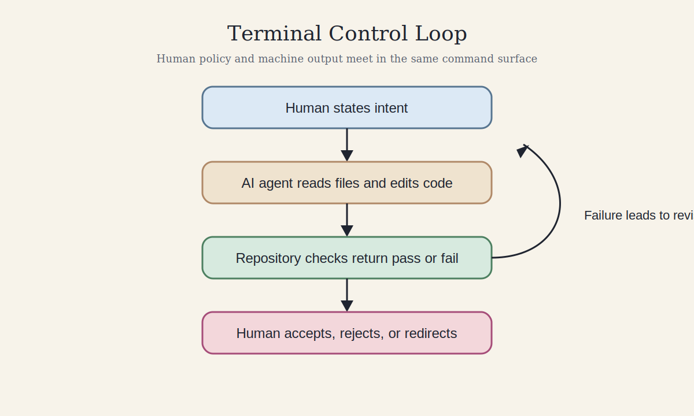
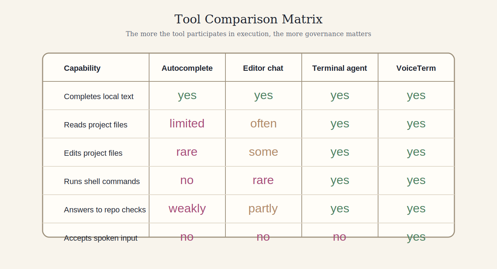

# The Terminal as Interface: AI CLI Tools and the New Programming Workflow

<nav class="paper-nav">
  Navigation
  <a href="./" class="nav-active">1. Overview</a>
  <a href="paper_technical/">2. Technical Companion &rarr;</a>
  <a href="paper_appendix/">3. Evidence Appendix &rarr;</a>
</nav>

This page is the public overview version of the paper.

If you want the fuller version, read:

1. [Technical companion](paper_technical/)
2. [Evidence appendix](paper_appendix/)

If you are not a programmer, start with:

1. Why This Paper Matters
2. The Main Idea
3. What Nontechnical Readers Should Take Away
4. Conclusion

## Why This Paper Matters

AI coding systems are often described as faster autocomplete. That description is too small. A terminal agent does not only suggest text. It reads project files, edits code, runs commands, observes failures, and responds to the same project rules a human developer faces.

That changes the meaning of the terminal. It is no longer only a place where programmers type commands. It becomes the place where human policy constrains machine output.

## The Main Idea

The central claim of this paper is that the terminal is becoming the governance surface for AI assisted programming.

This matters because software quality is not determined by generated text alone. It is determined by what the repository allows to pass. In a terminal workflow, that judgment can be encoded in scripts, checks, tests, and routing rules.

## Short Glossary

These terms appear often in the paper.

1. Terminal: a text based interface where programmers run commands.
2. CLI: a command line interface, which means software controlled through typed commands.
3. Guard script: a small program that checks whether a change follows a rule.
4. Workflow agent: an AI system that participates in a sequence of project actions, not only text generation.
5. Voice activity detection: software that detects when speech starts and stops.

## Why VoiceTerm Is A Strong Case Study

[VoiceTerm](https://github.com/jguida941/voiceterm) is a useful case study because it combines several important layers in one place.

1. It is a public Rust codebase with substantial runtime logic.
2. It sits on top of terminal based AI tools such as Codex and Claude Code.
3. It adds voice input and transcription to those workflows.
4. It uses executable policy to govern changes through checks and routing rules.

That combination makes it possible to study not just what AI tools generate, but how human authors govern them.

## What Nontechnical Readers Should Take Away

You do not need to know how to program to follow the main point.

1. AI coding tools are becoming less like spellcheck and more like junior workers inside a software process.
2. The terminal matters because it lets humans enforce rules that the AI has to obey.
3. Voice interfaces matter because they change programming from direct typing toward supervision, orchestration, and review.

## What Is New Here

The strongest insight is not simply that AI tools are productive. The stronger insight is that old command line ideas become more important when models enter the workflow.

Small scripts matter because they can fail deterministically.

Policy files matter because they define what kind of validation must run.

Voice matters because it pushes programming further away from direct text entry and closer to orchestration, review, and judgment.

## What The Technical Companion Adds

The [technical companion](paper_technical/) develops the argument in more detail. It includes:

1. A formal abstract and scope statement
2. Visual system diagrams
3. A concrete workflow example
4. Research questions
5. Limits and threats to validity
6. A historical timeline and tool comparison matrix

The [evidence appendix](paper_appendix/) provides the source map, repository snapshot, and a reading path for readers who want to verify the claims directly in the codebase.

## Conclusion

The command line is not fading away in the age of AI. It is becoming one of the main places where AI software work is supervised, measured, and governed.

That is why this paper focuses on the terminal not as a nostalgic interface, but as a modern control surface for human and machine collaboration.
