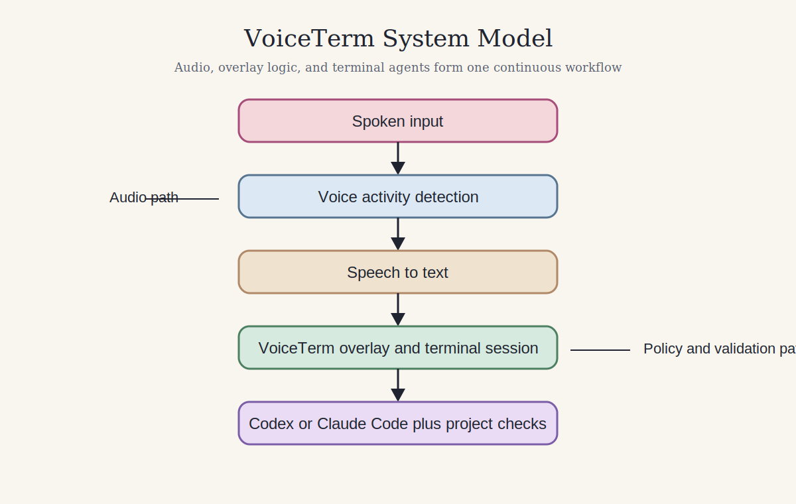
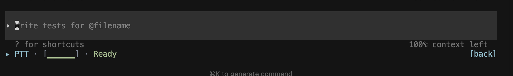
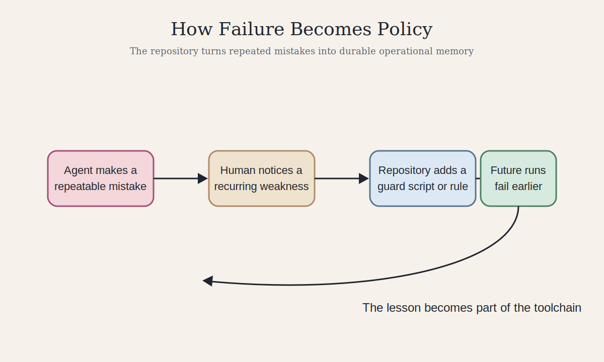
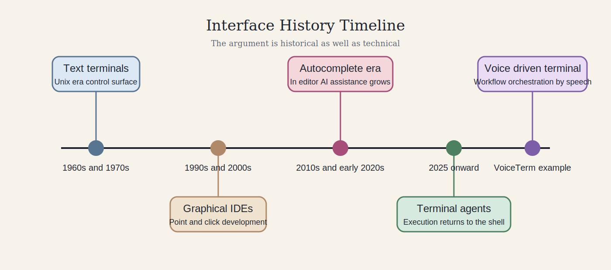

# The Terminal as Interface: Technical Companion

Return to the [public overview](../) or jump to the [evidence appendix](../paper_appendix/).

## Abstract

This technical paper argues that the terminal is re emerging as the control surface for AI assisted software development. It uses [VoiceTerm](https://github.com/jguida941/voiceterm), a public Rust project that adds voice input and transcription to terminal based AI tools, as its main case study. The central claim is that AI CLI tools are not best understood as autocomplete. They are workflow agents that read files, edit code, run commands, observe failures, and try again inside the same project boundary a human developer uses. That matters because the terminal lets human authors encode policy as executable checks. In VoiceTerm, those checks route tasks, block risky changes, record operational discipline, and convert repeated mistakes into reusable tooling. This paper explains the mechanical workflow, historical context, measurement opportunities, labor implications, and research questions that follow from that shift.

## Central Claim

The central claim of this paper is simple. The terminal is becoming the governance surface for AI assisted programming.

Older developer tools mostly helped a person type. Terminal agents do more. They inspect files, change code, run test suites, read failures, and respond to guard scripts. That makes the terminal more than an interface. It becomes the place where human policy constrains machine output.

This paper makes three contributions.

1. It explains why terminal based AI agents differ from editor autocomplete and chat.
2. It shows how small deterministic scripts can govern probabilistic model output.
3. It uses VoiceTerm to show how voice input pushes programming further toward orchestration, review, and systems judgment.

## Comparison At A Glance

The comparison matters because it clarifies what is actually new. Editor autocomplete helps with local text production. Terminal agents participate in the full workflow. VoiceTerm adds a further layer by changing how intent enters that workflow.

## Scope and Method

This is a technical case study based on the public VoiceTerm repository. It is not a controlled experiment and it does not claim universal results across all AI tools or teams. Its evidence comes from public source code, policy files, engineering history, and documentation linked throughout the paper.

On March 7, 2026, the repository snapshot used for this paper showed:

1. `614` commits
2. `101` tags
3. `34` top level `check_*.py` guard scripts in [dev/scripts/checks](https://github.com/jguida941/voiceterm/tree/master/dev/scripts/checks)
4. about `65,565` lines in [rust/src/bin/voiceterm](https://github.com/jguida941/voiceterm/tree/master/rust/src/bin/voiceterm)
5. about `42,974` lines in [dev/scripts/devctl](https://github.com/jguida941/voiceterm/tree/master/dev/scripts/devctl)

These counts matter because they show that VoiceTerm is not a toy example. It is large enough to make questions of governance, validation, and maintenance meaningful.

## Figure 1

When a programmer uses a terminal based AI assistant, they are not only receiving text suggestions. The agent can read local files, edit source code, and run shell commands on the same machine the programmer is using. If the programmer asks for a change, the agent can implement it, run a test suite, inspect the result, and revise its own output.

This changes the role of the command line. In older workflows, the terminal was often the place where a person manually invoked compilers, tests, and scripts. In AI assisted workflows, it is a shared execution surface. Human and agent both answer to the same commands, the same exit codes, and the same project rules.

That is why traditional command line tooling becomes more important, not less. Any rule that can be expressed as an executable script can become an enforceable boundary for an AI agent. The script does not need to know whether a human or model wrote the code. It only needs to return pass or fail.

## Figure 2

VoiceTerm is a useful case study because it combines several layers that are usually discussed separately. It is a Rust application with real time audio handling. It sits on top of terminal based AI tools. It supports more than one provider surface. It includes a large supporting automation layer. And it stores its development discipline in executable policy, not only in prose.

## Figure 2A

This screenshot matters because it shows that the project is not only a policy document or a command runner. It is an interface layer that sits in front of live terminal work and exposes state in a form a human can monitor quickly.

The repository uses [AGENTS.md](https://github.com/jguida941/voiceterm/blob/master/AGENTS.md) as a policy surface. That file defines a mandatory development procedure, an AI operating contract, an error recovery protocol, and a task router that maps kinds of work to required checks. This matters because the agent does not decide what done means. The repository does.

The project also includes guard scripts such as [check_rust_security_footguns.py](https://github.com/jguida941/voiceterm/blob/master/dev/scripts/checks/check_rust_security_footguns.py) and [check_rust_runtime_panic_policy.py](https://github.com/jguida941/voiceterm/blob/master/dev/scripts/checks/check_rust_runtime_panic_policy.py). One looks for risky code patterns. The other requires written justification for deliberate panic points. Together they show how a repository can move quality control from informal reviewer memory into repeatable executable rules.

## Example Workflow

An end to end example makes the difference clear.

1. A developer asks the agent to change runtime behavior.
2. The agent edits Rust source files.
3. The task router in `AGENTS.md` maps that change to the runtime validation bundle.
4. The agent runs the required checks.
5. Suppose `check_rust_runtime_panic_policy.py` fails because a panic site lacks justification.
6. The agent reads the failure output, adds the required reasoning or revises the code to avoid the panic, and runs the checks again.
7. The change is only viable when the repository rules accept it.

This is a small example, but it reveals a large shift. The model is not merely completing text. It is operating inside a rule bound workflow where scripts, tests, and policy files define the conditions of success.

## Figure 3

VoiceTerm also defines a continuous improvement rule. If the same workaround appears more than twice within the same plan scope, it must either be automated or logged in the [automation debt register](https://github.com/jguida941/voiceterm/blob/master/dev/audits/AUTOMATION_DEBT_REGISTER.md). That means mistakes can become tooling. Over time, the repository accumulates operational memory in script form.

## Historical Context

AI terminal agents sit within a longer history of how programmers interact with machines. Early Unix systems made text based terminals central to software work. Small programs were composed into larger workflows. Graphical development environments later displaced much of that activity. Editor autocomplete and in editor AI support pushed developers even farther from the shell.

Terminal based AI tools reverse part of that movement. They bring intelligence into the command line, but they also restore demand for small programs that can be composed, inspected, and trusted. In that sense, AI does not erase the Unix logic of small tools. It increases its value.

VoiceTerm makes this especially visible. A modern voice driven interface sits on top of a deeply traditional command driven substrate. The novelty is not that command line culture disappeared. The novelty is that it became the enforcement layer for model driven work.

## Authorship, Learning, and Human Judgment

AI CLI tools complicate authorship because intent and implementation can be split. A person may design the structure, direct the task, review the result, and own the architecture while the model writes much of the local code. That does not make the human irrelevant. It makes human judgment move upward into specification, validation, and policy design.

VoiceTerm shows this tension clearly. The codebase is large, but the most important decisions are not just lines of code. They are choices about how voice input reaches the terminal, how provider behavior is isolated, how guard scripts define acceptable output, and how development rules are enforced.

These tools also change learning. A beginner can now describe an outcome and receive a working implementation quickly. That can speed experimentation. It can also hide the slow debugging process that once built deep understanding. The question is no longer only “can the student write the code?” It is also “can the student judge the code, test it, and understand when the model is wrong?”

Voice input pushes this one step farther. When programming begins with speech, the act feels less like direct text entry and more like orchestration. That makes review, architecture, and validation even more central.

## Measurability and Research Questions

AI assisted programming is difficult to study because model behavior changes quickly and software productivity is hard to measure. Even so, the workflow creates useful opportunities for evidence.

VoiceTerm suggests several concrete research questions.

1. Do AI assisted changes increase risky code patterns relative to human only changes?
2. Do repository guard scripts reduce repeated failure modes over time?
3. Does a written panic justification policy reduce unjustified crash points?
4. How does voice input change latency, throughput, and cognitive flow during programming?
5. Does the presence of executable policy shift human effort from writing code toward designing checks and reviewing architecture?

These questions are not abstract. The repository already contains tools that could support parts of that analysis. Security pattern checks, panic policy checks, engineering history, and latency measurement all create evidence that can be studied over time.

## Labor, Governance, and Access

These tools change work by shifting value upward. Routine implementation becomes cheaper. Architectural judgment, security review, validation, and workflow design become more important.

VoiceTerm is useful here because it treats AI agents almost as managed workers inside a formal operating environment. The policy file sets behavioral rules. The task router maps work classes to checks. The automation debt register tracks repeated friction. The development process defines escalation and recovery steps. In organizational terms, the repository contains management structure, audit logic, and quality control, but those controls are aimed at human and model collaboration.

Access also matters. Terminal tools can be intimidating. Voice input can lower that barrier for some users, especially those who prefer speech or have limited typing endurance. At the same time, these systems still depend on capable hardware, network connectivity, and language access. So the same technology can lower one barrier while raising another.

## Limits and Threats To Validity

This paper uses one primary codebase. That gives it depth, but it also limits generalization.

Several constraints matter.

1. VoiceTerm is a high discipline project with unusually explicit policy. Many repositories are looser.
2. Model behavior changes quickly, so observations that fit one release cycle may age fast.
3. Repository counts change over time, so quantitative statements need dates.
4. Productivity, quality, and learning are only partly captured by lines of code, test counts, or commit volume.

These limits do not weaken the core argument. They clarify the boundary of the claim. The paper argues that the terminal is becoming a powerful governance surface for AI assisted development. It does not argue that every repository already uses that surface equally well.

## Conclusion

AI CLI tools are not best understood as advanced autocomplete. They are workflow agents that act inside the terminal, where human written commands, scripts, and policy files define the conditions under which their output is accepted.

VoiceTerm makes that visible in a concrete way. The project joins voice input, terminal execution, repository policy, and executable quality checks into one system. What emerges is not the disappearance of programmer judgment. It is a new location for it. The programmer who thrives in this environment is the one who can set policy, design architecture, interpret failures, and know when the model should not be trusted.

The terminal is therefore not a relic that survived the age of AI. It is becoming one of the main places where AI software work is supervised, measured, and governed.
